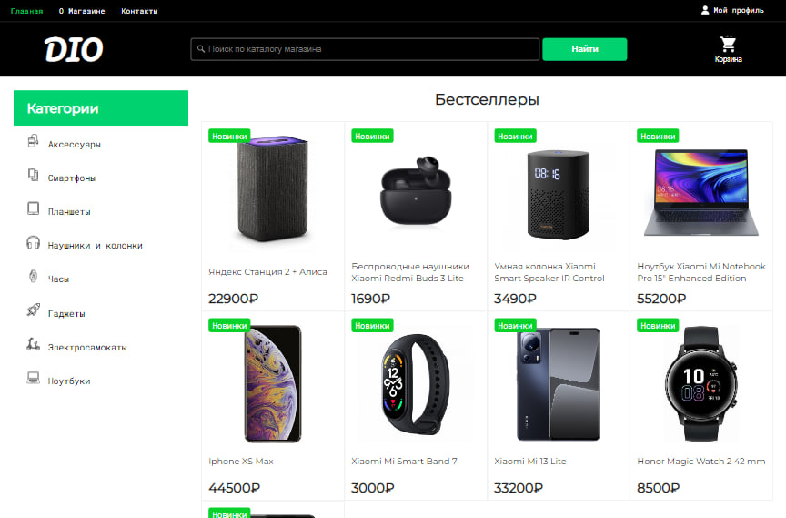
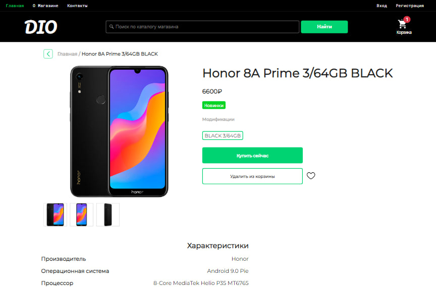
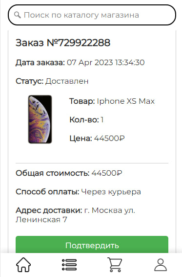

# DIO

DIO - это интернет-магазин, специализирующийся на продаже электроники, такой как телефоны, ноутбуки, гаджеты, часы и многое другое. В этом проекте вы найдете пример реализации интернет-магазина на базе PHP MVC.

## Технологии

DIO использует следующие технологии:

- Composer (autoload: psr-4)
- PHP MVC
- Шаблонизатор Twig
- База данных MySQL
- Система кэширования Redis
- PHPMailer для отправки email-уведомлений
- Predis для работы с Redis
- Phinx для миграций БД

## Установка и запуск

1. Клонируйте репозиторий на свой локальный компьютер: `git clone https://github.com/iWpoo/MVC-DIO-Store.git`
2. Установите зависимости, используя Composer: `composer install`
3. Перейдите в директорию `store/database/connection.php` и настройте его под свои нужды.
4. Перейдите в директорию `store/phinx.php` и также настройте его под свои нужды.
5. Запустите миграции для создания таблиц в БД: `php vendor/bin/phinx migrate`
6. Запустите веб-сервер: `php -S localhost:8000`
7. Откройте браузер и перейдите на `http://localhost:8000`

В миграциях также добавлены стартап примеры записей товара в таблицах БД. В случае необходимости можно удалить код добавления стартап примеры записей товара перейдя в директорию `store/database/migrations/` и удалить изображения товаров в директории `store/project/webroot/uploads/`.

## Скриншоты

## Контакты

Если у вас есть какие-либо вопросы или замечания относительно проекта, пожалуйста, свяжитесь со мной:

- Email: iwpoo@gmail.com
- Telegram: https://t.me/iwpoo
- GitHub: https://github.com/iWpoo
