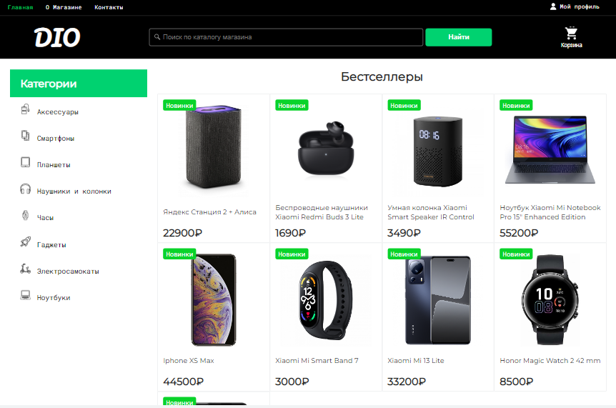

# DIO

DIO - это интернет-магазин, специализирующийся на продаже электроники, такой как телефоны, ноутбуки, гаджеты, часы и многое другое. В этом проекте вы найдете пример реализации интернет-магазина на базе PHP MVC.

## Технологии

DIO использует следующие технологии:

- Composer (autoload: psr-4)
- PHP MVC
- Шаблонизатор Twig
- База данных MySQL
- Система кэширования Redis
- PHPMailer для отправки email-уведомлений
- Predis для работы с Redis
- Phinx для миграций БД

## Установка и запуск

1. Клонируйте репозиторий на свой локальный компьютер: `git clone https://github.com/iwpoo/dio.git`

## Скриншоты

